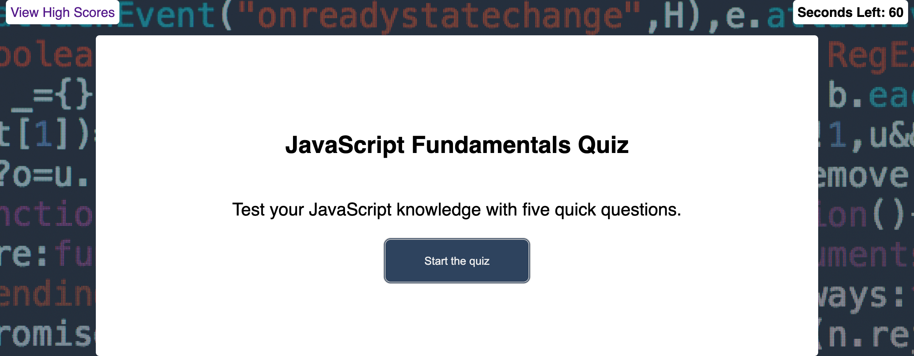

# JavaScript Fundamentals Quiz

## Description

For this project, I created a short quiz to test the user's knowledge of JavaScript. Here's how this application works:
1. When the user clicks the start button, the timer starts and first question displays.
2. When the user answers a question, they're notified whether their answer was "correct" or "wrong."
3. If they answered incorrectly, the timer decreases by 10 seconds.
4. The game ends when all questions are answered or the timer reaches 0.
5. When the game ends, the user can save their intials and score.

Link to live webpage: [JavaScript Fundamentals Quiz](https://evperkinsjr.github.io/js-fundamentals-quiz/)

## Screenshot

> **Note**: This was project designed for desktop viewing. Some elements may not display properly at smaller resolutions.

## Technologies Used

- HTML
- CSS
- JavaScript